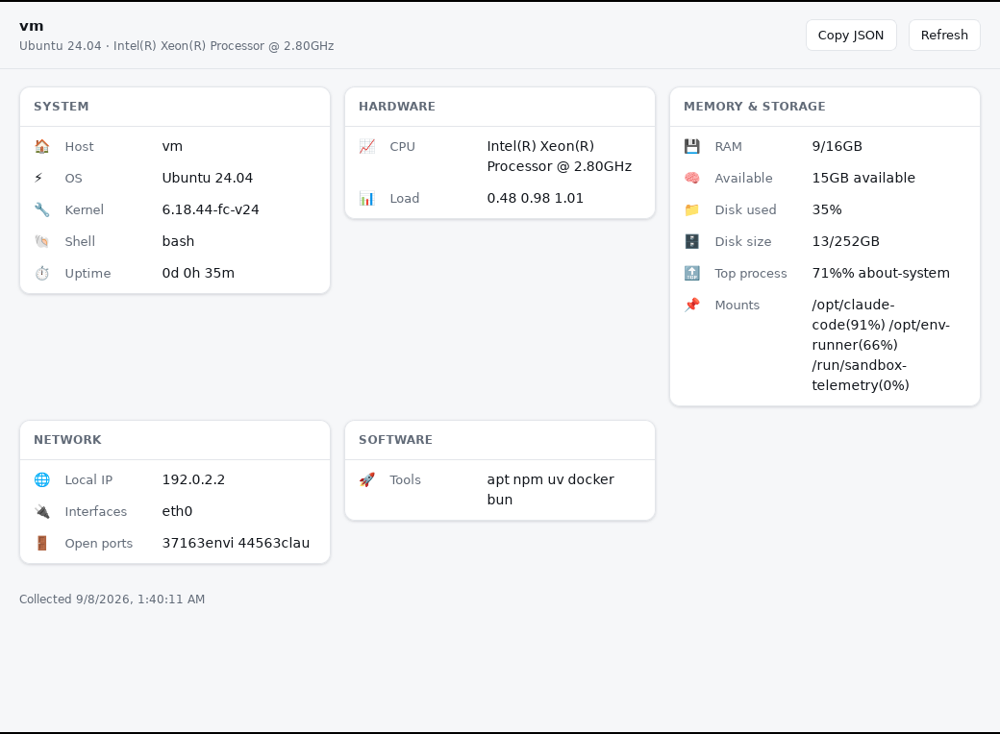

# About System — desktop app

`about-system` as an installable desktop app for Windows, macOS, and Linux: the same 30+ metrics
the CLI prints as one emoji line, laid out as a panel you can leave open. The CLI is compiled into
the app, so a user who has never installed Node can download an installer and run it.



Scaffolded from `packages/native-app-wrapper` — see its `docs/LOCAL_APPS.md` for how the
"bundle a CLI as a GUI app" pattern works, and `docs/BUILDING.md` for the full build reference.
The short version is below.

```
native/
├── profiles/about-system.json   # the app's whole identity: name, id, version, window, sidecar
├── dist/index.html               # the app's UI — one dependency-free file
├── scripts/build-sidecar.mjs     # compiles the CLI into src-tauri/binaries/
├── src-tauri/                    # the Tauri shell (generated config + icons, Rust window host)
└── docs/                         # BUILDING, LOCAL_APPS, APP_STORES
```

## How it fits together

The window loads `dist/index.html`. That page calls the app's `sidecar_output` command, which runs
the bundled `about-system` binary with `--json` and hands back its stdout. Nothing is fetched over
the network and nothing has to be installed first — which is the point of packaging it this way
rather than shipping a web page.

## Prerequisites

- [Rust](https://rustup.rs) 1.77.2+, Node 18+, and [Bun](https://bun.sh) (used to compile the CLI
  into a single executable).
- Your platform's Tauri prerequisites:
  - **Windows** — [Microsoft C++ Build Tools](https://visualstudio.microsoft.com/visual-cpp-build-tools/)
    ("Desktop development with C++"). WebView2 ships with Windows 10 1803+ and Windows 11.
  - **macOS** — Xcode Command Line Tools: `xcode-select --install`.
  - **Linux** — on Debian/Ubuntu:
    ```bash
    sudo apt install libwebkit2gtk-4.1-dev libgtk-3-dev libayatana-appindicator3-dev \
      librsvg2-dev build-essential curl wget file libssl-dev
    ```
    See [Tauri's prerequisites](https://v2.tauri.app/start/prerequisites/) for Fedora/Arch names.

## Build

```bash
cd packages/about-system-info
bun install            # the CLI's own dependencies — the sidecar build needs them

cd native
npm install
npm run build:desktop  # regenerates config, compiles the sidecar, builds the installers
```

Installers land in `src-tauri/target/release/bundle/`:

| Platform | Artifacts |
|---|---|
| Windows | `msi/About System_<version>_x64_en-US.msi`, `nsis/About System_<version>_x64-setup.exe` |
| macOS | `dmg/About System_<version>_<arch>.dmg`, `macos/About System.app` |
| Linux | `deb/*.deb`, `rpm/*.rpm`, `appimage/*.AppImage` |

**Each installer must be built on its own OS** — Tauri does not cross-compile, and neither does the
sidecar. That's what `.github/workflows/about-system-desktop.yml` is for: it runs the same two
commands on a Windows, macOS, and Linux runner and attaches every artifact to one GitHub Release.

For a universal macOS build, compile both sidecar architectures first (Tauri does not `lipo` the
sidecar for you) and then build for the universal target:

```bash
rustup target add x86_64-apple-darwin aarch64-apple-darwin
bun build --compile --target=bun-darwin-x64 ../src/about-system-cli.ts \
  --outfile src-tauri/binaries/about-system-x86_64-apple-darwin
bun build --compile --target=bun-darwin-arm64 ../src/about-system-cli.ts \
  --outfile src-tauri/binaries/about-system-aarch64-apple-darwin
npx tauri build --target universal-apple-darwin
```

## Develop

```bash
npm run dev
```

`predev` regenerates the Tauri config from the profile and rebuilds the sidecar first, so a change
to either the CLI or the profile takes effect on the next run. Editing `dist/index.html` needs only
a window reload.

To iterate on the UI without a Rust build at all, open `dist/index.html` in a browser — it detects
that the IPC bridge is missing and says so instead of failing silently.

## Releasing

1. Bump `version` in `profiles/about-system.json` (this is the version that ends up in every
   installer's metadata — the CLI's own npm version in `../package.json` is separate and moves on
   its own schedule).
2. Commit, then tag: `git tag about-system-desktop-v0.2.0 && git push origin about-system-desktop-v0.2.0`.
3. The workflow builds all three platforms and attaches them to a draft release. Review and publish.

Installers are unsigned by default, so first launch shows an "unidentified developer" warning on
macOS and a SmartScreen prompt on Windows. `docs/BUILDING.md` lists the secrets that turn signing
on, and `docs/APP_STORES.md` covers store submission if you want to go further than GitHub
Releases.

## Known limitations

- **`bench` / `gpu_bench` are empty in the app.** Those two fields rank your CPU/GPU against
  `src/bench/*-geekbench.json`, which the CLI loads from disk at runtime. A `bun build --compile`
  binary has no such disk path, so the lookup fails and the fields come back empty — the app hides
  empty fields, so they simply don't appear. Every other field works. Fixing it means having the
  CLI import those JSON files as modules instead of reading them by path.
- **Desktop only.** Android and iOS don't let an app spawn a bundled executable, so there is no
  mobile build of this app. See the wrapper's `docs/MOBILE.md`.
- **The app is large** (~100 MB installed) because the compiled CLI carries a JavaScript runtime.
  That's the cost of an install that needs nothing preinstalled.
